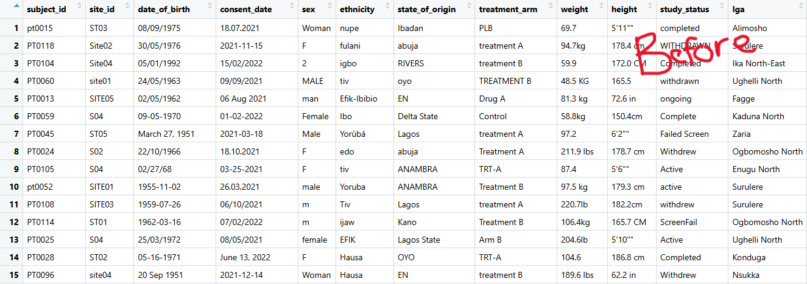
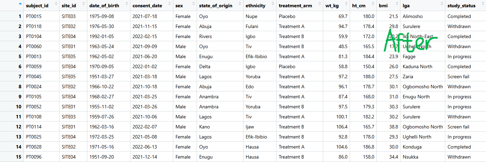
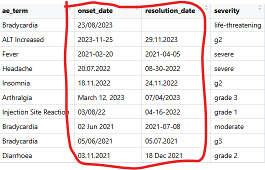
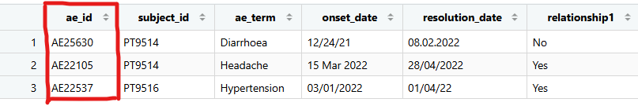
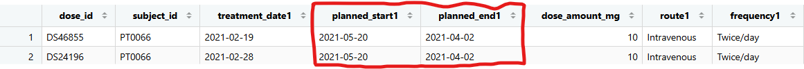

# Clinical Trial Data Cleaning and Quality Assessment Using R

## Project Overview

This project demonstrates the cleaning and quality assessment of multisite clinical trial data using R.

The workflow involved:

- Cleaning patient demographic data
- Standardizing adverse event records
- Harmonizing laboratory results
- Cleaning dosing information
- Detecting data quality issues
- Producing analysis-ready datasets

## Objectives

- Import and integrate multisite clinical datasets into R
- Standardize categorical variables across datasets
- Clean and harmonize dates, units, and identifiers
- Detect inconsistencies and potential data entry errors
- Generate cleaned datasets for downstream analysis
- Document quality issues identified during the cleaning process

## Datasets Used

| Dataset | Records | Variables |
|----------|----------|----------|
| Patients | 141 | 12 |
| Adverse Events | 215 | 10 |
| Dosing | 307 | 10 |
| Laboratory Results | 410 | 10 |
| Sites | 5 | 6 |

## Tools and Packages

- R
- tidyverse
- lubridate
- janitor
- stringi
- rio
- skimr

## Data Quality Issues Identified

- Typographical errors
- Mixed date formats
- Ambiguous dates
- Mixed measurement units
- Invalid identifiers
- Logical inconsistencies
- Non-standard categorical values

## Project Structure

```text
clinical-trial-data-cleaning-r/
│
├── data/
├── script/
├── output/
├── report/
├── screenshots/
└── README.md
```

## Screenshots

### Raw Patient Dataset



### Cleaned Patient Dataset



### Ambiguous Dates Identified



### Ghost IDs Identified



### Dosing Date Inconsistencies



## Outputs Generated

- cleaned_patients_data.xlsx
- cleaned_adverse_event_data.xlsx
- cleaned_lab_result_data.xlsx
- cleaned_dosing_data.xlsx
- ghost_ids_adverse_data.xlsx
- ghost_lab_id.xlsx
- ambiguous_dates_in_adverse_data.xlsx
- inco_start_end_trt_date.xlsx

## Skills Demonstrated

- Clinical Data Cleaning
- Clinical Data Management
- Data Validation
- Data Quality Assessment
- Data Quality Control
- Date Standardization
- Unit Harmonization
- Identifier Verification
- R Programming
- Reproducible Workflows
- Clinical Research Data Handling

## Conclusion

This project demonstrates an end-to-end clinical data cleaning workflow using R. Through systematic standardization, validation, anomaly detection, and quality checks, multisite clinical trial datasets were transformed into analysis-ready formats suitable for downstream statistical analysis and reporting.
